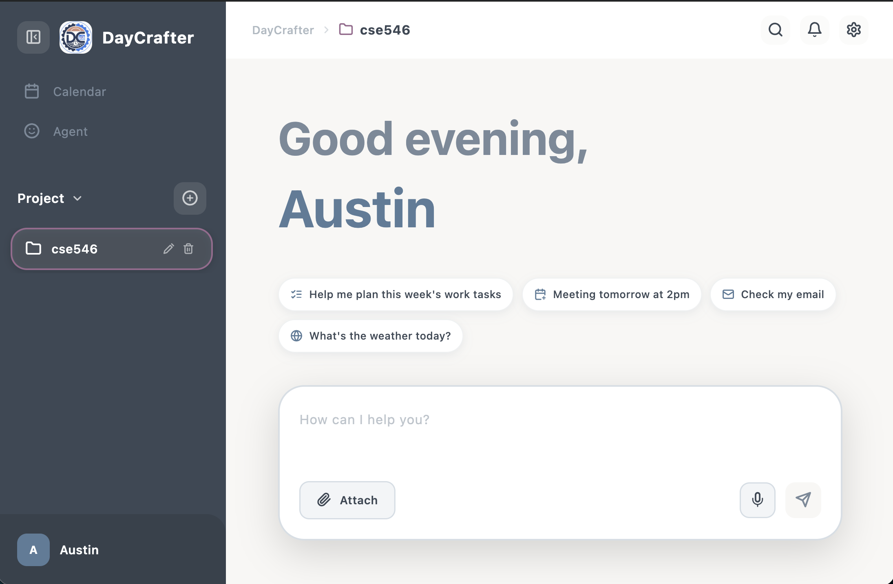

# DayCrafter

An AI-powered calendar and project management application built with Flutter. DayCrafter combines conversational AI with structured task scheduling, Gmail integration, and multi-project organization into a single desktop experience.

<p align="center">
  
</p>

---

## What's Special

> **"Just tell the AI what you need — it handles the rest."**
Most calendar apps force you to click through forms, pick dates, and manually organize. DayCrafter flips that model: **you chat, it plans**.

### 🗣️ Conversational Task Creation
Say *"Add a meeting with Professor Chen tomorrow at 2pm"* and DayCrafter creates a structured calendar event instantly — no forms, no clicking through date pickers. The AI understands natural language and maps it directly onto your schedule.

### 🤖 Multi-Agent AI Planning (MCP + CrewAI)
Describe a complex goal like *"Plan a 3-day hackathon"* and DayCrafter dispatches a team of AI agents (via the [Model Context Protocol](https://modelcontextprotocol.io/) and CrewAI) that collaborate to produce a full task breakdown with priorities, deadlines, and time estimates — all in one conversation turn.

### 🔍 Semantic Memory & Vector Search
Every message and task is embedded as a vector (via OpenAI embeddings + ObjectBox HNSW). DayCrafter doesn't just keyword-match — it **understands meaning**. Search "that meeting about the budget" and it finds the right conversation even if "budget" never appeared in the original text.

### 🌐 Global Agent — Cross-Project Intelligence
A dedicated Global Agent sits above all your projects. It reads memories and upcoming events across every project, so you can ask *"What do I have this week?"* or *"Create a new project for my thesis"* without switching context.

### 📧 Gmail Integration via Natural Language
Ask *"Check my inbox"* or *"Find emails from Professor Wang"* and the AI reads your Gmail, summarizes the results, and presents them in chat. Switch between multiple Google accounts with a single command.

### 🎙️ Voice Input
Record a voice message or upload an audio file — DayCrafter transcribes it via OpenAI Whisper and processes it as a regular chat message, enabling hands-free task management.

---

## Features

### AI Chat Assistant

- Conversational interface powered by OpenAI GPT for managing tasks and answering questions
- Real-time streaming responses with Markdown rendering
- Web search integration for up-to-date information
- Context-aware short-term memory that retains conversation history per project
- Semantic search across messages and tasks using vector embeddings (ObjectBox HNSW)

### Task and Schedule Planning in Project Agent

- **Direct task creation**: Tell the AI to "add a meeting tomorrow at 2pm" and it creates the calendar event automatically
- **AI-powered planning**: Describe a complex project (e.g. "plan a 3-day conference") and the CrewAI-based MCP backend generates a structured task breakdown with priorities, deadlines, and time estimates
- **Priority levels**: High, Medium, and Low priority with color-coded indicators
- **Task detail editing**: Modify title, description, dates, and priority from a detail dialog

### Calendar Views

- **Day view**: Hourly time grid with task blocks positioned by start and end time
- **Week view**: 7-day column layout with time-based task rendering
- **Month view**: Traditional monthly grid with date selection and task indicators
- Smooth navigation between views with date-aware highlighting

### Project Management

- Create and manage multiple independent projects
- Edit project names and colors after creation
- Each project has its own chat history, tasks, and calendar
- Color-coded project labels with customizable colors
- Emoji-based project icons via built-in emoji picker
- Project search and quick switching from the sidebar

### User Authentication

- Local account system with login, registration, and password recovery
- Password hashing with SHA-256
- Per-user project isolation

### Notifications

- In-app notification overlay for upcoming tasks and reminders
- Time-aware alerts with relative timestamps (e.g. "in 30 minutes")

### Search

- Full-text search across all messages in a project
- Semantic vector search for finding related content by meaning
- Task-specific search with filtering

### Settings and Customization

- **Theme**: Dark and Light mode with a Morandi-inspired color palette
- **Language**: English and Traditional Chinese (zh-TW)
- **Audio**: Sound effects for interactions

---

## Prerequisites

- Flutter SDK (Dart SDK ^3.10.4)
- Xcode (for macOS/iOS builds)
- Python 3.10+ with `uv` or `pip` (for the MCP backend)
- OpenAI API Key
- Google Cloud OAuth 2.0 credentials (for Gmail features)

---

## Installation

### 1. Clone the Repository

```bash
git clone https://github.com/austin20010423/DayCrafter.git
cd DayCrafter
```

### 2. Install Flutter Dependencies

```bash
flutter pub get
```

### 3. Generate ObjectBox Database Model

```bash
dart run build_runner build --delete-conflicting-outputs
```

### 4. Configure Flutter Environment

Create a `.env` file in the project root:

```bash
touch .env
```

Add your OpenAI API key:

```env
OPENAI_API_KEY=your_openai_api_key_here
```

Get your API key from the [OpenAI Platform](https://platform.openai.com/account/api-keys).

### 5. Set Up the MCP Backend

The MCP backend lives in the `MCP_tools/` directory and provides task planning and Gmail integration.

```bash
cd MCP_tools

# Create and activate a virtual environment
python3 -m venv .venv
source .venv/bin/activate

# Install dependencies
pip install -r requirements.txt
```

Create the MCP backend `.env` file:

```bash
cp .env.example .env
```

Edit `MCP_tools/.env` and fill in your keys:

```env
MODEL=gpt-4.1-mini
OPENAI_API_KEY=your_openai_api_key_here
```

### 6. Set Up Gmail Integration (Optional)

To enable Gmail features (check email, switch accounts):

1. Go to [Google Cloud Console](https://console.cloud.google.com/) and create or select a project
2. Enable the **Gmail API**
3. Configure the **OAuth consent screen** (External type is fine; publish the app to remove test user restrictions)
4. Create an **OAuth 2.0 Client ID** (Application type: Desktop app)
5. Download the credentials JSON and save it as `MCP_tools/credentials.json`

On first use, the app will open a browser window for Google sign-in. A `token.json` file will be generated automatically for subsequent logins.

### 7. Run the Application

```bash
# Return to the project root
cd ..

# For macOS
flutter run -d macos

# For Chrome (Web)
flutter run -d chrome

# For iOS Simulator
flutter run -d ios

# For Android Emulator
flutter run -d android
```

The MCP backend server starts automatically when the Flutter app launches — no separate terminal needed.

---

## Building for Release

### macOS

```bash
flutter build macos --release
```

The built app will be at `build/macos/Build/Products/Release/DayCrafter.app`.

### Distributing to Another Mac

1. **Zip the app**:
   ```bash
   cd build/macos/Build/Products/Release
   zip -r ~/Desktop/DayCrafter.zip DayCrafter.app
   ```

2. **Send** the zip via AirDrop, USB drive, cloud storage, etc.

3. **On the receiving Mac**: Unzip and right-click → **Open** to bypass Gatekeeper (the app is not notarized).

> **Note**: For public distribution, you will need an [Apple Developer account](https://developer.apple.com) ($99/year) to code-sign and notarize the app.

---

## Project Structure

```
DayCrafter/
├── lib/
│   ├── main.dart              # App entry point and root widget
│   ├── models.dart            # Data models (Task, Message, Project)
│   ├── provider.dart          # State management (ChangeNotifier)
│   ├── styles.dart            # Theme and color definitions
│   ├── config/                # App configuration
│   ├── database/              # ObjectBox database setup
│   ├── l10n/                  # Localization (en, zh-TW)
│   ├── services/              # Business logic services
│   │   ├── audio_service.dart
│   │   ├── embedding_service.dart
│   │   ├── global_agent_tools.dart
│   │   ├── local_auth_service.dart
│   │   ├── short_term_memory.dart
│   │   └── task_scheduler.dart
│   └── widgets/               # UI components
│       ├── auth/              # Login, registration screens
│       ├── calendar/          # Day, Week, Month views
│       ├── chat_view.dart     # AI chat interface
│       ├── sidebar.dart       # Project navigation sidebar
│       ├── settings_view.dart # Settings panel
│       └── ...
├── MCP_tools/                 # Python MCP backend
├── assets/                    # Images and static assets
└── pubspec.yaml               # Flutter dependencies
```

---

## Tech Stack

| Layer | Technology |
|-------|-----------|
| Frontend | Flutter (Dart) |
| State Management | Provider (ChangeNotifier) |
| Local Database | ObjectBox (NoSQL + Vector Search) |
| AI Backend | OpenAI GPT API |
| Task Planning | CrewAI via MCP (Model Context Protocol) |
| Email | Gmail API (OAuth 2.0) |
| Localization | Flutter l10n (ARB files) |

---

## License

This project is private and not published to pub.dev.
